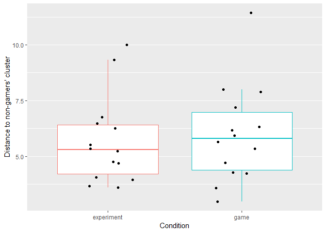
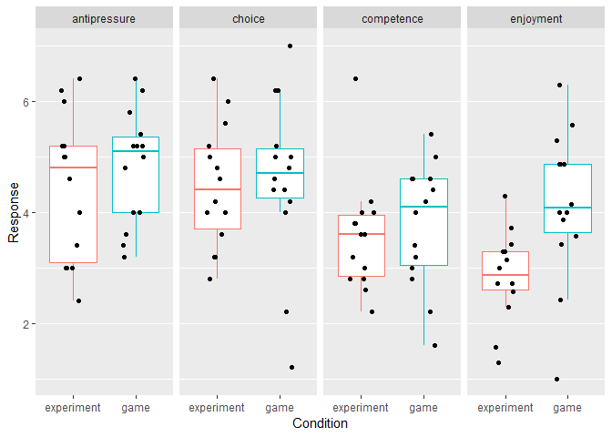

```r
library('tidyverse')
library('knitr')
library('lme4')
library('lmerTest')
library('BayesFactor')
library('psycho')
library('coin')
library('car')
library('lmPerm')
library('boot')
```

# Loading and preprocessing the data


```r
rm(list= ls())

results <- tibble(filename= list.files(path= 'Data', pattern = 'csv$')) %>%
  group_by(filename) %>%
  do(suppressMessages(read_csv2(file.path('Data', .)))) %>%

  # converting selected variables to factors and using meaningful labels instead of boolean balues
  ungroup() %>%
  mutate(COA= as.factor(COA), 
        Target= as.factor(Target), 
        Condition= as.factor(Condition),
        Observer= as.factor(Observer),
        
        Match= ifelse(Match == 'True', 'match', 'mismatch'), 
        Response= ifelse(Response == 'True', 'match', 'mismatch'), 
        Correct= Match == Response)

# adding block index within the COA
results <- results %>%
  group_by(Observer, Condition, COA, Block) %>%
  summarise() %>%
  
  group_by(Observer, Condition, COA) %>%
  mutate(coaBlockIndex= 1:n()) %>%

  right_join(results, by= c('Observer', 'Condition', 'COA', 'Block')) %>%

    # retain only 12 blocks to facilitate comparison (some observers had more blocks)
  filter(Block <= 12)
```

Computing score for each trial, including the _experiment_ condition group. Later, this would show whether having a maximal score in mind alters your behavior. For each trial the score is calculated as $$S(t)= Combo(t) \times \frac{ 10 \times (4-RT(t))}{3}$$/, where _RT(t)_ is the response time and _Combo(t)_ is a combo multiplier. The latter is increased by 1 after every correct answer but is reset to 1 after a mistake. 


```r
# computing time-based score, maximum is 10, but time penalty applies
# this value will be translated into the real score later, based on combo and response
results <- results %>%
  # computing the time-based score the way it was done in the game
  mutate(timebased_score= ceiling(10*((4-RT)/3))) %>%
         
  # clamping the score within 0..10 range, -1 means that the response was incorrect
  mutate(timebased_score= ifelse(timebased_score>10, 10, timebased_score),
         timebased_score= ifelse(timebased_score<0, 0, timebased_score), 
         timebased_score= ifelse(!Correct, -1, timebased_score))
         

# computing combo-based score         
compute_score_within_block <- function(timebased_score){
  combo <- 1
  score <- rep(NA, length(timebased_score))
  for(iTrial in 1:length(timebased_score)){
    if (timebased_score[iTrial]>=0){
      score[iTrial] <- timebased_score[iTrial] * combo
      combo <- combo + 1
    }
    else{
      score[iTrial] <- 0
      combo <- 1
    }
  }
  
  score
}


results <- results %>%
  group_by(Observer, Condition, COA, Block) %>%
  mutate(score= compute_score_within_block(timebased_score))

rm('compute_score_within_block')
```


# Comparing two experimental groups to see if having add-on gamification changes behaviors

## Effect of the cue-onset asynchrony (COA) and experimental condition on _performance_

```r
#' Computes mean value for the sample
#'
#' @description Computes mean value for the \code{variableOfInterest} using a sample of row, 
#'  defined by \code{bootstrapIndex}, from the \code{variableOfInterest}. 
#' @param irrelevantData fake data supplied to \code{boot} function those length is equal to the total 
#' number of rows for a single observer 
#' @param bootstrapIndex index of rows supplied by \code{boot} function.
#' @param dfOfInterest table with actual group data
#' @param variableOfInterest name of the column that must be sampled
#' @param avgFun function used for computing average value
#'
#' @return sampled group mean 
getVariableSampleMean <- function(irrelevantData, bootstrapIndex, dfOfInterest, variableOfInterest, avgFun){
  dfOfInterest %>%
    # first sampling each observer the same way and computing their averages
    group_by(Observer) %>%
    slice(bootstrapIndex) %>%
    summarise(varMean= avgFun(!!as.name(variableOfInterest), na.rm= TRUE)) %>%
  
    # then, the group average
    ungroup() %>%
    summarise(varMean= mean(varMean)) %>%
    
    # returning only the group mean
    pull(varMean)
}

#' Computes variable mean and 95% bootstrapped bca CI 
#'
#' @param data data table
#' @param variableOfInterest name of the column to analyze
#' @param seed seed for the random numbers generator (to make CIs reproducable). NULL means no seeding
#' @param avgFun function used for computing average value, defaults to 'mean'
#' @param R number of bootstrap iterations, defaults to 2000
#'
#' @return table with columns bcaLower, meanValue, bcaUpper
getvariableCI <- function(data, variableOfInterest, seed= NULL, avgFun= mean, R= 2000){
  # figuring out number of trials per observer
  trialN <- data %>%
    group_by(Observer) %>%
    summarise(trialCount= n()) %>%
    pull(trialCount)
  
  # seeding the random numbers generator
  if (!is.null(seed)){
    set.seed(seed)
  }
  
  # sample mean
  sampledMean <-boot(data= 1:max(trialN), 
                     statistic = getVariableSampleMean, R= R, 
                     dfOfInterest= data, 
                     variableOfInterest= variableOfInterest, 
                     avgFun= avgFun)
  
  # compute CIs
  sampledCI <- boot.ci(boot.out= sampledMean, type= 'bca')
  
  # compute mean over ALL the data
  meanValue <- getVariableSampleMean(NULL, 1:max(trialN), data, variableOfInterest, avgFun)
  
  # package for output
  data.frame(bcaLower= sampledCI$bca[4], meanValue= meanValue, bcaUpper= sampledCI$bca[5])
}
```


```r
groupPerformance <- results %>%
  group_by(Condition, COA, coaBlockIndex) %>%
  do(getvariableCI(data= ., variableOfInterest = 'Correct', seed = 1538985527))

ggplot(data= groupPerformance, 
       aes(x= coaBlockIndex, y= meanValue, ymin= bcaLower, ymax= bcaUpper,
           color= Condition, linetype= Condition)) + 
  geom_errorbar(width= 0.3, linetype= 'solid')+
  geom_line() +
  geom_point(aes(shape= Condition), size= 3) +
  # geom_point(position = position_jitter(width= 0.2), color= 'black') +
  facet_grid(.~COA) +
  ylab('Performance [%]') +
  xlab('Block index') +
  theme(panel.grid.minor.x = element_blank(), legend.position = "none")
```

<!-- -->

__Performance: Frequentist ANOVA__

```r
performance_coa <- results %>%
  group_by(Observer, Condition, COA, coaBlockIndex) %>%
  summarise(Performance= 100 * mean(Correct), 
            logitPerformance= car::logit(Performance, percents = TRUE, adjust = 0.025))

# frequentist ANOVA
kable(summary(aov(logitPerformance ~ coaBlockIndex * COA * Condition, data= performance_coa))[[1]])
```

                                Df        Sum Sq      Mean Sq      F value      Pr(>F)
----------------------------  ----  ------------  -----------  -----------  ----------
coaBlockIndex                    1    11.1344593   11.1344593   18.7791985   0.0000196
COA                              2     7.0831621    3.5415811    5.9731732   0.0028351
Condition                        1     4.8921520    4.8921520    8.2510243   0.0043415
coaBlockIndex:COA                2     2.6884010    1.3442005    2.2671068   0.1052528
coaBlockIndex:Condition          1     0.3457168    0.3457168    0.5830803   0.4456631
COA:Condition                    2     0.3379669    0.1689834    0.2850047   0.7521990
coaBlockIndex:COA:Condition      2     0.0225065    0.0112532    0.0189795   0.9812006
Residuals                      324   192.1043018    0.5929145           NA          NA


**Performance: Permutation ANOVA**

```r
kable(summary(aovp(Performance ~ coaBlockIndex * COA * Condition, data= performance_coa))[[1]])
```

```
## [1] "Settings:  unique SS : numeric variables centered"
```

                                Df      R Sum Sq    R Mean Sq   Iter    Pr(Prob)
----------------------------  ----  ------------  -----------  -----  ----------
coaBlockIndex                    1    2568.02094   2568.02094   5000   0.0000000
COA                              2    1589.65257    794.82629   5000   0.0072000
coaBlockIndex:COA                2     519.62942    259.81471   1880   0.1765957
Condition                        1    1683.42066   1683.42066   5000   0.0000000
coaBlockIndex:Condition          1      98.23754     98.23754     51   0.8235294
COA:Condition                    2      70.55535     35.27767    143   0.5804196
coaBlockIndex:COA:Condition      2      28.10330     14.05165     51   0.7450980
Residuals                      324   47903.86285    147.85143     NA          NA

**Performance: Bayesian ANOVA**


```r
performance_coa %>%
  ungroup() %>%
  mutate(coaBlockIndex= as.factor(coaBlockIndex)) %>%
  anovaBF(logitPerformance ~ coaBlockIndex * COA * Condition, data= .) %>% 
  extractBF(.) %>%
  select(-time, -code) %>%
  kable(.)
```

```
## Warning: data coerced from tibble to data frame
```

                                                                                                                                         bf       error
----------------------------------------------------------------------------------------------------------------------------  -------------  ----------
Condition                                                                                                                         4.5749029   0.0000000
COA                                                                                                                               5.2346402   0.0000749
Condition + COA                                                                                                                  26.6702397   0.0127398
Condition + COA + Condition:COA                                                                                                   1.9887021   0.0204531
coaBlockIndex                                                                                                                   189.2595007   0.0000848
Condition + coaBlockIndex                                                                                                      1059.9886631   0.0147141
COA + coaBlockIndex                                                                                                            1361.3714977   0.0163593
Condition + COA + coaBlockIndex                                                                                                8449.5350296   0.0142830
Condition + COA + Condition:COA + coaBlockIndex                                                                                 653.9757839   0.0181766
Condition + coaBlockIndex + Condition:coaBlockIndex                                                                              71.5257383   0.0214370
Condition + COA + coaBlockIndex + Condition:coaBlockIndex                                                                       617.6274110   0.0364090
Condition + COA + Condition:COA + coaBlockIndex + Condition:coaBlockIndex                                                        45.9000416   0.0384412
COA + coaBlockIndex + COA:coaBlockIndex                                                                                         101.0679101   0.0121088
Condition + COA + coaBlockIndex + COA:coaBlockIndex                                                                             695.6844693   0.0216234
Condition + COA + Condition:COA + coaBlockIndex + COA:coaBlockIndex                                                              53.8234651   0.0398021
Condition + COA + coaBlockIndex + Condition:coaBlockIndex + COA:coaBlockIndex                                                    47.7663333   0.0275887
Condition + COA + Condition:COA + coaBlockIndex + Condition:coaBlockIndex + COA:coaBlockIndex                                     3.5885181   0.0243076
Condition + COA + Condition:COA + coaBlockIndex + Condition:coaBlockIndex + COA:coaBlockIndex + Condition:COA:coaBlockIndex       0.1439643   0.0239429


```r
rm(groupPerformance, performance_coa)
```

## Effect of the cue-onset asynchrony (COA) and experimental condition on _response times_


```r
groupMedianRT <- results %>%
  group_by(Condition, COA, coaBlockIndex) %>%
  do(getvariableCI(data= ., variableOfInterest = 'RT', seed = 1538988495, avgFun = median))


ggplot(data= groupMedianRT, 
       aes(x= coaBlockIndex, y= meanValue, ymin= bcaLower, ymax= bcaUpper,
           color= Condition, linetype= Condition)) + 
  geom_errorbar(width= 0.3, linetype= 'solid')+
  geom_line() +
  geom_point(aes(shape= Condition), size= 3) +
  # geom_point(position = position_jitter(width= 0.2), color= 'black') +
  facet_grid(.~COA) +
  ylab('Median RT [s]') +
  xlab('Block index') +
  theme(panel.grid.minor.x = element_blank(), legend.position = "none")
```

<!-- -->

```r
# ggsave('Between-RT.pdf', RT_plot, path= 'Plots', width = 20, height = 20/1.5, units = 'cm', useDingbats= FALSE)
```

__RT: Frequentist ANOVA__

```r
# frequentist ANOVA

RT_coa <- results %>%
  group_by(Observer, Condition, COA, coaBlockIndex) %>%
  summarise(RT= median(RT))

kable(summary(aov(RT ~ coaBlockIndex * COA * Condition, data= RT_coa))[[1]])
```

                                Df        Sum Sq     Mean Sq      F value      Pr(>F)
----------------------------  ----  ------------  ----------  -----------  ----------
coaBlockIndex                    1     8.5593621   8.5593621   16.9380538   0.0000490
COA                              2     0.0060435   0.0030217    0.0059797   0.9940382
Condition                        1     3.4040437   3.4040437    6.7362351   0.0098773
coaBlockIndex:COA                2     0.0254060   0.0127030    0.0251379   0.9751773
coaBlockIndex:Condition          1     0.0010744   0.0010744    0.0021261   0.9632511
COA:Condition                    2     0.0053423   0.0026712    0.0052859   0.9947281
coaBlockIndex:COA:Condition      2     0.5221628   0.2610814    0.5166519   0.5970050
Residuals                      324   163.7279790   0.5053333           NA          NA


**RT: Permutation ANOVA**

```r
kable(summary(aovp(RT ~ coaBlockIndex * COA * Condition, data= RT_coa))[[1]])
```

```
## [1] "Settings:  unique SS : numeric variables centered"
```

                                Df      R Sum Sq   R Mean Sq   Iter    Pr(Prob)
----------------------------  ----  ------------  ----------  -----  ----------
coaBlockIndex                    1     8.5593621   8.5593621   5000   0.0000000
COA                              2     0.0060435   0.0030217     51   1.0000000
coaBlockIndex:COA                2     0.0254060   0.0127030     51   1.0000000
Condition                        1     3.4040437   3.4040437   5000   0.0130000
coaBlockIndex:Condition          1     0.0010744   0.0010744     51   0.9019608
COA:Condition                    2     0.0053423   0.0026712     51   1.0000000
coaBlockIndex:COA:Condition      2     0.5221628   0.2610814    230   0.5956522
Residuals                      324   163.7279790   0.5053333     NA          NA

**RT: Bayesian ANOVA**


```r
RT_coa %>%
  ungroup() %>%
  mutate(coaBlockIndex= as.factor(coaBlockIndex)) %>%
  anovaBF(RT ~ coaBlockIndex * COA * Condition, data= .) %>% 
  extractBF(.) %>%
  select(-time, -code) %>%
  kable(.)
```

```
## Warning: data coerced from tibble to data frame
```

                                                                                                                                       bf       error
----------------------------------------------------------------------------------------------------------------------------  -----------  ----------
Condition                                                                                                                       2.7634003   0.0000000
COA                                                                                                                             0.0326108   0.0001208
Condition + COA                                                                                                                 0.0879200   0.0164691
Condition + COA + Condition:COA                                                                                                 0.0053783   0.0267189
coaBlockIndex                                                                                                                  27.0903428   0.0000054
Condition + coaBlockIndex                                                                                                      84.2480944   0.0126515
COA + coaBlockIndex                                                                                                             0.8812840   0.0119948
Condition + COA + coaBlockIndex                                                                                                 2.7678558   0.0162078
Condition + COA + Condition:COA + coaBlockIndex                                                                                 0.1760305   0.0409290
Condition + coaBlockIndex + Condition:coaBlockIndex                                                                             4.2654107   0.0148172
Condition + COA + coaBlockIndex + Condition:coaBlockIndex                                                                       0.1531740   0.0459070
Condition + COA + Condition:COA + coaBlockIndex + Condition:coaBlockIndex                                                       0.0093866   0.0886329
COA + coaBlockIndex + COA:coaBlockIndex                                                                                         0.0103358   0.0104064
Condition + COA + coaBlockIndex + COA:coaBlockIndex                                                                             0.0351321   0.0271588
Condition + COA + Condition:COA + coaBlockIndex + COA:coaBlockIndex                                                             0.0019110   0.0165301
Condition + COA + coaBlockIndex + Condition:coaBlockIndex + COA:coaBlockIndex                                                   0.0016893   0.0246050
Condition + COA + Condition:COA + coaBlockIndex + Condition:coaBlockIndex + COA:coaBlockIndex                                   0.0001060   0.0387483
Condition + COA + Condition:COA + coaBlockIndex + Condition:coaBlockIndex + COA:coaBlockIndex + Condition:COA:coaBlockIndex     0.0000042   0.0306626


```r
rm(RT_coa)
```

## Effect of the cue-onset asynchrony (COA) and experimental condition on _total score_

```r
groupScore <- results %>%
  group_by(Condition, COA, coaBlockIndex) %>%
  do(getvariableCI(data= ., variableOfInterest = 'score', seed = 1538989294))

ggplot(data= groupScore, 
       aes(x= coaBlockIndex, y= meanValue, ymin= bcaLower, ymax= bcaUpper,
           color= Condition, linetype= Condition)) + 
  geom_errorbar(width= 0.3, linetype= 'solid')+
  geom_line() +
  geom_point(aes(shape= Condition), size= 3) +
  # geom_point(position = position_jitter(width= 0.2), color= 'black') +
  facet_grid(.~COA) +
  ylab('Score [thousands of points]') +
  xlab('Block index') +
  theme(panel.grid.minor.x = element_blank(), legend.position = "none")
```

<!-- -->


**Score: Frequentist ANOVA**

```r
# frequentist ANOVA
# frequentist ANOVA
score_coa <- results %>%
  group_by(Observer, Condition, COA, coaBlockIndex) %>%
  summarise(`Block Score`= sum(score))

kable(summary(aov(`Block Score` ~ coaBlockIndex * COA * Condition, data= score_coa))[[1]])
```

                                Df         Sum Sq      Mean Sq      F value      Pr(>F)
----------------------------  ----  -------------  -----------  -----------  ----------
coaBlockIndex                    1     56330349.0   56330349.0   15.9337826   0.0000812
COA                              2     60049892.9   30024946.4    8.4929523   0.0002541
Condition                        1      5722164.0    5722164.0    1.6185896   0.2042009
coaBlockIndex:COA                2     12342389.1    6171194.5    1.7456038   0.1761770
coaBlockIndex:Condition          1        13645.8      13645.8    0.0038599   0.9504992
COA:Condition                    2      4163687.5    2081843.7    0.5888770   0.5555430
coaBlockIndex:COA:Condition      2       633022.2     316511.1    0.0895293   0.9143841
Residuals                      324   1145430033.5    3535277.9           NA          NA


**Score: Permutation ANOVA**

```r
kable(summary(aovp(`Block Score` ~ coaBlockIndex * COA * Condition, data= score_coa))[[1]])
```

```
## [1] "Settings:  unique SS : numeric variables centered"
```

                                Df       R Sum Sq    R Mean Sq   Iter    Pr(Prob)
----------------------------  ----  -------------  -----------  -----  ----------
coaBlockIndex                    1     56330349.0   56330349.0   5000   0.0000000
COA                              2     60049892.9   30024946.4   5000   0.0000000
coaBlockIndex:COA                2     12342389.1    6171194.5   5000   0.1934000
Condition                        1      5722164.0    5722164.0    686   0.1282799
coaBlockIndex:Condition          1        13645.8      13645.8     51   0.8235294
COA:Condition                    2      4163687.5    2081843.7    706   0.2733711
coaBlockIndex:COA:Condition      2       633022.2     316511.1     94   1.0000000
Residuals                      324   1145430033.5    3535277.9     NA          NA

**Score: Bayesian ANOVA**


```r
score_coa %>%
  ungroup() %>%
  mutate(coaBlockIndex= as.factor(coaBlockIndex)) %>%
  anovaBF(`Block Score` ~ coaBlockIndex * COA * Condition, data= .) %>% 
  extractBF(.) %>%
  select(-time, -code) %>%
  kable(.)
```

```
## Warning: data coerced from tibble to data frame
```

                                                                                                                                         bf       error
----------------------------------------------------------------------------------------------------------------------------  -------------  ----------
Condition                                                                                                                         0.2463402   0.0000003
COA                                                                                                                              53.8523013   0.0000876
Condition + COA                                                                                                                  13.4403139   0.0196401
Condition + COA + Condition:COA                                                                                                   1.3076253   0.0288018
coaBlockIndex                                                                                                                    55.7763590   0.0000041
Condition + coaBlockIndex                                                                                                        14.1482004   0.0125327
COA + coaBlockIndex                                                                                                            4392.1696966   0.0082750
Condition + COA + coaBlockIndex                                                                                                1188.9838540   0.0231637
Condition + COA + Condition:COA + coaBlockIndex                                                                                 127.3012040   0.0695955
Condition + coaBlockIndex + Condition:coaBlockIndex                                                                               0.7071780   0.0650855
Condition + COA + coaBlockIndex + Condition:coaBlockIndex                                                                        58.0628060   0.0386965
Condition + COA + Condition:COA + coaBlockIndex + Condition:coaBlockIndex                                                         5.6819413   0.0242080
COA + coaBlockIndex + COA:coaBlockIndex                                                                                         282.0096646   0.0234094
Condition + COA + coaBlockIndex + COA:coaBlockIndex                                                                              76.6034434   0.0232715
Condition + COA + Condition:COA + coaBlockIndex + COA:coaBlockIndex                                                               7.3872742   0.0239872
Condition + COA + coaBlockIndex + Condition:coaBlockIndex + COA:coaBlockIndex                                                     3.5803429   0.0163687
Condition + COA + Condition:COA + coaBlockIndex + Condition:coaBlockIndex + COA:coaBlockIndex                                     0.3549484   0.0273893
Condition + COA + Condition:COA + coaBlockIndex + Condition:coaBlockIndex + COA:coaBlockIndex + Condition:COA:coaBlockIndex       0.0201239   0.0385784

```r
rm(score_coa, score_plot)
```

```
## Warning in rm(score_coa, score_plot): Objekt 'score_plot' nicht gefunden
```


# Post-study questionnaires


```r
questionnaire <- suppressMessages(read_csv2(file.path('Questionnaire', 'Questionnaire_ErsteTestung_ohneIFN.csv'))) %>%
  ungroup() %>%
  mutate(Condition= as.factor(Condition), 
         Condition= fct_recode(Condition, game= '1', experiment= '2'), 
         Condition= fct_relevel(Condition, 'experiment'))
```

## Gamer/Non-gamer

This questionnaire is important to check the balance between the two experimental groups


```r
gamer <- questionnaire %>%
  mutate(d_nonGamer= sqrt((GP01_01-2.58)^2+(GP02_01-1.61)^2+
                     (GP02_02-1.88)^2+(GP02_03-4.3)^2+
                     (GP02_04-1.49)^2+(GP02_05-2.69)^2+
                     (GP02_06-2.20)^2+(GP02_07-2.59)^2+
                     (GP02_08-4.68)^2+(GP02_09-2.20)^2)) %>%
  select(Observer, Condition, d_nonGamer)

oneway_test(d_nonGamer ~ Condition, gamer)
```

```
## 
## 	Asymptotic Two-Sample Fisher-Pitman Permutation Test
## 
## data:  d_nonGamer by Condition (experiment, game)
## Z = -0.37617, p-value = 0.7068
## alternative hypothesis: true mu is not equal to 0
```

```r
gamer_plot <- gamer %>% ggplot(aes(x= Condition, y= d_nonGamer, color= Condition)) +
  geom_boxplot(outlier.shape = NA) + 
  geom_point(position = position_dodge2(width= 0.05), color= 'black') + 
  ylab("Distance to non-gamers' cluster") + 
  theme(panel.grid.major.x = element_blank(), legend.position = "none")
print(gamer_plot)
```

<!-- -->

```r
rm(gamer, gamer_plot)
```

## Intrinsic Motivation

```r
# computing subscales for the Intrinsic Motivation
IM <- questionnaire %>%
  mutate(enjoyment =  ((IM01_01 + IM01_05 + IM01_08 + IM01_10 + IM01_14 + IM01_17 + IM01_20)/7),
         competence = ((IM01_04 + IM01_07 + IM01_12 + IM01_16 + IM01_22)/5),
         choice = ((IM01_03 + IM01_11 + IM01_15 + IM01_19 + IM01_21)/5),
         pressure =((IM01_02 + IM01_06 + IM01_09 + IM01_13 + IM01_18)/5)) %>%
  
  select(Observer, Condition, enjoyment, competence, choice, pressure) %>%
  gather(key= "Subscale", value = "Response", -Observer, -Condition)

oneway_permutation_test <- function(subscaleDF){
  test_results <- oneway_test(Response ~ Condition, data= subscaleDF)
  
  
  tibble(Subscale= subscaleDF$Subscale[1], Z= statistic(test_results), pvalue= pvalue(test_results))
}

# Fisher-Pitman permutation test on each subscale, multiple comparions adjustment via Holm's method 
IM %>% 
  group_by(Subscale) %>%
  do(oneway_permutation_test(.)) %>%
  ungroup() %>%
  mutate(`p(adjusted)`= p.adjust(pvalue, method = 'holm')) %>%
  kable(.)
```


Subscale               Z      pvalue   p(adjusted)
-----------  -----------  ----------  ------------
choice        -0.2628970   0.7926300     1.0000000
competence    -0.5404975   0.5888540     1.0000000
enjoyment     -2.7117838   0.0066922     0.0267689
pressure       0.8032385   0.4218369     1.0000000

```r
IM_plot <- IM %>% ggplot(aes(x= Condition, y= Response, color= Condition)) +
  geom_boxplot(outlier.shape = NA) + 
  geom_point(position = position_dodge2(width = 0.15), color= 'black') + 
  facet_grid(. ~ Subscale) + 
  theme(panel.grid.major.x = element_blank(), legend.position = "none")

print(IM_plot)
```

<!-- -->

```r
rm('oneway_permutation_test', IM, IM_plot)
```
