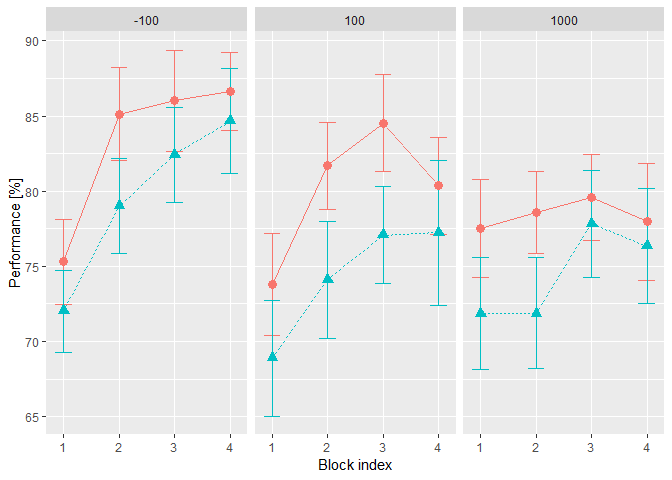
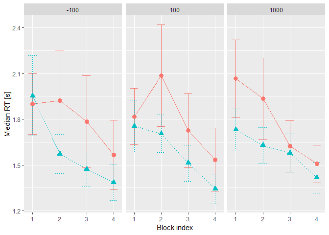
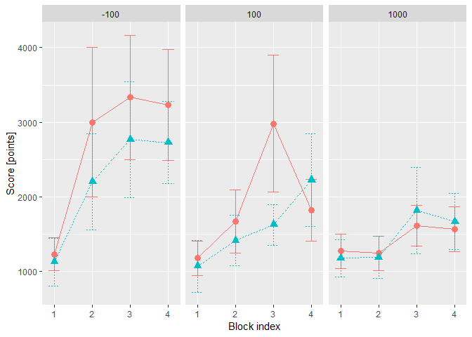

# Loading and preprocessing the data


```r
results <- tibble(filename= list.files(path= 'Data', pattern = 'csv$')) %>%
  rowwise() %>%
  do(suppressMessages(read_csv2(file.path('Data', .)))) %>%

  # converting selected variables to factors and using meaningful labels instead of boolean balues
  ungroup() %>%
  mutate(COA= as.factor(COA), 
        Target= as.factor(Target), 
        Condition= as.factor(Condition),
        Observer= as.factor(Observer),
        
        Match= ifelse(Match == 'True', 'match', 'mismatch'), 
        Response= ifelse(Response == 'True', 'match', 'mismatch'), 
        Correct= Match == Response)

# adding block index within the COA
results <- results %>%
  group_by(Observer, Condition, COA, Block) %>%
  summarise() %>%
  
  group_by(Observer, Condition, COA) %>%
  mutate(coaBlockIndex= 1:n()) %>%

  right_join(results, by= c('Observer', 'Condition', 'COA', 'Block')) %>%

    # retain only 12 blocks to facilitate comparison (some observers had more blocks)
  filter(Block <= 12)
```

Computing score for each trial, including the _experiment_ condition group. Later, this would show whether having a maximal score in mind alters your behavior. For each trial the score is calculated as $$S(t)= Combo(t) \times \frac{ 10 \times (4-RT(t))}{3}$$/, where _RT(t)_ is the response time and _Combo(t)_ is a combo multiplier. The latter is increased by 1 after every correct answer but is reset to 1 after a mistake. 


```r
# computing time-based score, maximum is 10, but time penalty applies
# this value will be translated into the real score later, based on combo and response
results <- results %>%
  # computing the time-based score the way it was done in the game
  mutate(timebased_score= ceiling(10*((4-RT)/3))) %>%
         
  # clamping the score within 0..10 range, -1 means that the response was incorrect
  mutate(timebased_score= ifelse(timebased_score>10, 10, timebased_score),
         timebased_score= ifelse(timebased_score<0, 0, timebased_score), 
         timebased_score= ifelse(!Correct, -1, timebased_score))
         

# computing combo-based score         
compute_score_within_block <- function(timebased_score){
  combo <- 1
  score <- rep(NA, length(timebased_score))
  for(iTrial in 1:length(timebased_score)){
    if (timebased_score[iTrial]>=0){
      score[iTrial] <- timebased_score[iTrial] * combo
      combo <- combo + 1
    }
    else{
      score[iTrial] <- 0
      combo <- 1
    }
  }
  
  score
}


results <- results %>%
  group_by(Observer, Condition, COA, Block) %>%
  mutate(score= compute_score_within_block(timebased_score))

rm('compute_score_within_block')
```


# Comparing two experimental groups to see if having add-on gamification changes behaviors

## Effect of the cue-onset asynchrony (COA) and experimental condition on _performance_

```r
performance_coa <- results %>%
  group_by(Observer, Condition, COA, coaBlockIndex) %>%
  summarise(Performance= 100 * mean(Correct), 
            logitPerformance= logit(Performance, percents = TRUE, adjust = 0.025))
  
# plot with SE as errorbars
performance_plot <-performance_coa %>%
  group_by(Condition, COA, coaBlockIndex) %>%
  summarise(Performance_avg= mean(Performance), 
            Performance_serr= sd(Performance)/sqrt(n()-1), 
            Performance_lo= Performance_avg-Performance_serr, 
            Performance_hi= Performance_avg+Performance_serr) %>%

ggplot(aes(x= coaBlockIndex, y= Performance_avg, ymin= Performance_lo, ymax= Performance_hi,
           color= Condition, linetype= Condition)) + 
  geom_errorbar(width= 0.3, linetype= 'solid')+
  geom_line() +
  geom_point(aes(shape= Condition), size= 3) +
  # geom_point(position = position_jitter(width= 0.2), color= 'black') +
  facet_grid(.~COA) +
  ylab('Performance [%]') +
  xlab('Block index') +
  theme(panel.grid.minor.x = element_blank(), legend.position = "none")

print(performance_plot)
```

<!-- -->

__Performance: Frequentist ANOVA__

```r
# frequentist ANOVA
kable(summary(aov(logitPerformance ~ coaBlockIndex * COA * Condition, data= performance_coa))[[1]])
```

                                Df        Sum Sq      Mean Sq      F value      Pr(>F)
----------------------------  ----  ------------  -----------  -----------  ----------
coaBlockIndex                    1    11.1344593   11.1344593   18.7791985   0.0000196
COA                              2     7.0831621    3.5415811    5.9731732   0.0028351
Condition                        1     4.8921520    4.8921520    8.2510243   0.0043415
coaBlockIndex:COA                2     2.6884010    1.3442005    2.2671068   0.1052528
coaBlockIndex:Condition          1     0.3457168    0.3457168    0.5830803   0.4456631
COA:Condition                    2     0.3379669    0.1689834    0.2850047   0.7521990
coaBlockIndex:COA:Condition      2     0.0225065    0.0112532    0.0189795   0.9812006
Residuals                      324   192.1043018    0.5929145           NA          NA


**Performance: Permutation ANOVA**

```r
kable(summary(aovp(Performance ~ coaBlockIndex * COA * Condition, data= performance_coa))[[1]])
```

```
## [1] "Settings:  unique SS : numeric variables centered"
```

                                Df      R Sum Sq    R Mean Sq   Iter    Pr(Prob)
----------------------------  ----  ------------  -----------  -----  ----------
coaBlockIndex                    1    2568.02094   2568.02094   5000   0.0000000
COA                              2    1589.65257    794.82629   5000   0.0214000
coaBlockIndex:COA                2     519.62942    259.81471    575   0.1686957
Condition                        1    1683.42066   1683.42066   5000   0.0000000
coaBlockIndex:Condition          1      98.23754     98.23754     51   1.0000000
COA:Condition                    2      70.55535     35.27767     51   1.0000000
coaBlockIndex:COA:Condition      2      28.10330     14.05165     51   0.8431373
Residuals                      324   47903.86285    147.85143     NA          NA

**Performance: Bayesian ANOVA**


```r
performance_coa %>%
  ungroup() %>%
  mutate(coaBlockIndex= as.factor(coaBlockIndex)) %>%
  anovaBF(logitPerformance ~ coaBlockIndex * COA * Condition, data= .) %>% 
  extractBF(.) %>%
  select(-time, -code) %>%
  kable(.)
```

```
## Warning: data coerced from tibble to data frame
```

                                                                                                                                         bf       error
----------------------------------------------------------------------------------------------------------------------------  -------------  ----------
Condition                                                                                                                         4.5749029   0.0000000
COA                                                                                                                               5.2346402   0.0000749
Condition + COA                                                                                                                  25.9127187   0.0107079
Condition + COA + Condition:COA                                                                                                   1.9733409   0.0332936
coaBlockIndex                                                                                                                   189.2595007   0.0000848
Condition + coaBlockIndex                                                                                                      1060.9892678   0.0149002
COA + coaBlockIndex                                                                                                            1359.5312814   0.0160082
Condition + COA + coaBlockIndex                                                                                                9344.4543176   0.0552735
Condition + COA + Condition:COA + coaBlockIndex                                                                                 645.1427034   0.0217923
Condition + coaBlockIndex + Condition:coaBlockIndex                                                                              70.8541683   0.0214433
Condition + COA + coaBlockIndex + Condition:coaBlockIndex                                                                       895.8692678   0.3573524
Condition + COA + Condition:COA + coaBlockIndex + Condition:coaBlockIndex                                                        45.5746239   0.0253110
COA + coaBlockIndex + COA:coaBlockIndex                                                                                         102.5340355   0.0157107
Condition + COA + coaBlockIndex + COA:coaBlockIndex                                                                             761.6871485   0.0679167
Condition + COA + Condition:COA + coaBlockIndex + COA:coaBlockIndex                                                              53.3445766   0.0296973
Condition + COA + coaBlockIndex + Condition:coaBlockIndex + COA:coaBlockIndex                                                    47.8918079   0.0400269
Condition + COA + Condition:COA + coaBlockIndex + Condition:coaBlockIndex + COA:coaBlockIndex                                     3.8861388   0.0377903
Condition + COA + Condition:COA + coaBlockIndex + Condition:coaBlockIndex + COA:coaBlockIndex + Condition:COA:coaBlockIndex       0.1545356   0.0312422


```r
rm(performance_coa, performance_plot)
```

## Effect of the cue-onset asynchrony (COA) and experimental condition on _response times_


```r
RT_coa <- results %>%
  group_by(Observer, Condition, COA, coaBlockIndex) %>%
  summarise(RT= median(RT))

# plot with SE as errorbars
RT_plot <- RT_coa %>%
  group_by(Condition, COA, coaBlockIndex) %>%
  summarise(RT_avg= mean(RT), 
            RT_serr= sd(RT)/sqrt(n()-1), 
            RT_lo= RT_avg-RT_serr, 
            RT_hi= RT_avg+RT_serr) %>%

 ggplot(aes(x= coaBlockIndex, y= RT_avg, ymin= RT_lo, ymax= RT_hi,
           color= Condition, linetype= Condition)) + 
  geom_errorbar(width= 0.3)+
  geom_line() +
  geom_point(aes(shape= Condition), size= 3) +
  # geom_point(position = position_jitter(width= 0.2), color= 'black') +
  facet_grid(.~COA) +
  ylab('Median RT [s]') +
  xlab('Block index') +
  theme(panel.grid.minor.x = element_blank(), legend.position = "none")

print(RT_plot)
```

<!-- -->

```r
# ggsave('Between-RT.pdf', RT_plot, path= 'Plots', width = 20, height = 20/1.5, units = 'cm', useDingbats= FALSE)
```

__RT: Frequentist ANOVA__

```r
# frequentist ANOVA
kable(summary(aov(RT ~ coaBlockIndex * COA * Condition, data= RT_coa))[[1]])
```

                                Df        Sum Sq     Mean Sq      F value      Pr(>F)
----------------------------  ----  ------------  ----------  -----------  ----------
coaBlockIndex                    1     8.5593621   8.5593621   16.9380538   0.0000490
COA                              2     0.0060435   0.0030217    0.0059797   0.9940382
Condition                        1     3.4040437   3.4040437    6.7362351   0.0098773
coaBlockIndex:COA                2     0.0254060   0.0127030    0.0251379   0.9751773
coaBlockIndex:Condition          1     0.0010744   0.0010744    0.0021261   0.9632511
COA:Condition                    2     0.0053423   0.0026712    0.0052859   0.9947281
coaBlockIndex:COA:Condition      2     0.5221628   0.2610814    0.5166519   0.5970050
Residuals                      324   163.7279790   0.5053333           NA          NA


**RT: Permutation ANOVA**

```r
kable(summary(aovp(RT ~ coaBlockIndex * COA * Condition, data= RT_coa))[[1]])
```

```
## [1] "Settings:  unique SS : numeric variables centered"
```

                                Df      R Sum Sq   R Mean Sq   Iter    Pr(Prob)
----------------------------  ----  ------------  ----------  -----  ----------
coaBlockIndex                    1     8.5593621   8.5593621   5000   0.0000000
COA                              2     0.0060435   0.0030217     51   1.0000000
coaBlockIndex:COA                2     0.0254060   0.0127030     51   0.9607843
Condition                        1     3.4040437   3.4040437   3481   0.0281528
coaBlockIndex:Condition          1     0.0010744   0.0010744     51   0.9411765
COA:Condition                    2     0.0053423   0.0026712     51   1.0000000
coaBlockIndex:COA:Condition      2     0.5221628   0.2610814    224   0.3839286
Residuals                      324   163.7279790   0.5053333     NA          NA

**RT: Bayesian ANOVA**


```r
RT_coa %>%
  ungroup() %>%
  mutate(coaBlockIndex= as.factor(coaBlockIndex)) %>%
  anovaBF(RT ~ coaBlockIndex * COA * Condition, data= .) %>% 
  extractBF(.) %>%
  select(-time, -code) %>%
  kable(.)
```

```
## Warning: data coerced from tibble to data frame
```

                                                                                                                                       bf       error
----------------------------------------------------------------------------------------------------------------------------  -----------  ----------
Condition                                                                                                                       2.7634003   0.0000000
COA                                                                                                                             0.0326108   0.0001208
Condition + COA                                                                                                                 0.0901119   0.0291426
Condition + COA + Condition:COA                                                                                                 0.0052442   0.0177033
coaBlockIndex                                                                                                                  27.0903428   0.0000054
Condition + coaBlockIndex                                                                                                      86.4935104   0.0217529
COA + coaBlockIndex                                                                                                             0.8717169   0.0136684
Condition + COA + coaBlockIndex                                                                                                 2.8145508   0.0211176
Condition + COA + Condition:COA + coaBlockIndex                                                                                 0.1570270   0.0146295
Condition + coaBlockIndex + Condition:coaBlockIndex                                                                             4.5626296   0.0340604
Condition + COA + coaBlockIndex + Condition:coaBlockIndex                                                                       0.1437182   0.0218100
Condition + COA + Condition:COA + coaBlockIndex + Condition:coaBlockIndex                                                       0.0116308   0.2374444
COA + coaBlockIndex + COA:coaBlockIndex                                                                                         0.0105101   0.0170194
Condition + COA + coaBlockIndex + COA:coaBlockIndex                                                                             0.0327493   0.0150279
Condition + COA + Condition:COA + coaBlockIndex + COA:coaBlockIndex                                                             0.0022143   0.1099864
Condition + COA + coaBlockIndex + Condition:coaBlockIndex + COA:coaBlockIndex                                                   0.0018440   0.0609857
Condition + COA + Condition:COA + coaBlockIndex + Condition:coaBlockIndex + COA:coaBlockIndex                                   0.0001011   0.0254628
Condition + COA + Condition:COA + coaBlockIndex + Condition:coaBlockIndex + COA:coaBlockIndex + Condition:COA:coaBlockIndex     0.0000044   0.0348625


```r
rm(RT_coa, RT_plot)
```

## Effect of the cue-onset asynchrony (COA) and experimental condition on _total score_

```r
score_coa <- results %>%
  group_by(Observer, Condition, COA, coaBlockIndex) %>%
  summarise(`Block Score`= sum(score))

# plot with SE as errorbars
score_plot <- score_coa %>%
  group_by(Condition, COA, coaBlockIndex) %>%
  summarise(Score_avg= mean(`Block Score`), 
            Score_serr= sd(`Block Score`)/sqrt(n()-1), 
            Score_lo= Score_avg-Score_serr, 
            Score_hi= Score_avg+Score_serr) %>%

ggplot(aes(x= coaBlockIndex, y= Score_avg, ymin= Score_lo, ymax= Score_hi,
           color= Condition, linetype= Condition)) + 
  geom_errorbar(width= 0.3)+
  geom_line() +
  geom_point(aes(shape= Condition), size= 3) +
  # geom_point(position = position_jitter(width= 0.2), color= 'black') +
  facet_grid(.~COA) +
  ylab('Score [points]') +
  xlab('Block index') + 
  theme(panel.grid.minor.x = element_blank(), legend.position = "none")
print(score_plot)
```

<!-- -->

```r
# ggsave('Between-Score.pdf', score_plot, path= 'Plots', width = 20, height = 20/1.5, units = 'cm', useDingbats= FALSE)
```


**Score: Frequentist ANOVA**

```r
# frequentist ANOVA
# frequentist ANOVA
kable(summary(aov(`Block Score` ~ coaBlockIndex * COA * Condition, data= score_coa))[[1]])
```

                                Df         Sum Sq      Mean Sq      F value      Pr(>F)
----------------------------  ----  -------------  -----------  -----------  ----------
coaBlockIndex                    1     56330349.0   56330349.0   15.9337826   0.0000812
COA                              2     60049892.9   30024946.4    8.4929523   0.0002541
Condition                        1      5722164.0    5722164.0    1.6185896   0.2042009
coaBlockIndex:COA                2     12342389.1    6171194.5    1.7456038   0.1761770
coaBlockIndex:Condition          1        13645.8      13645.8    0.0038599   0.9504992
COA:Condition                    2      4163687.5    2081843.7    0.5888770   0.5555430
coaBlockIndex:COA:Condition      2       633022.2     316511.1    0.0895293   0.9143841
Residuals                      324   1145430033.5    3535277.9           NA          NA


**Score: Permutation ANOVA**

```r
kable(summary(aovp(`Block Score` ~ coaBlockIndex * COA * Condition, data= score_coa))[[1]])
```

```
## [1] "Settings:  unique SS : numeric variables centered"
```

                                Df       R Sum Sq    R Mean Sq   Iter    Pr(Prob)
----------------------------  ----  -------------  -----------  -----  ----------
coaBlockIndex                    1     56330349.0   56330349.0   5000   0.0000000
COA                              2     60049892.9   30024946.4   5000   0.0000000
coaBlockIndex:COA                2     12342389.1    6171194.5    600   0.2350000
Condition                        1      5722164.0    5722164.0    368   0.2146739
coaBlockIndex:Condition          1        13645.8      13645.8     51   1.0000000
COA:Condition                    2      4163687.5    2081843.7    388   0.2835052
coaBlockIndex:COA:Condition      2       633022.2     316511.1    373   0.8257373
Residuals                      324   1145430033.5    3535277.9     NA          NA

**Score: Bayesian ANOVA**


```r
score_coa %>%
  ungroup() %>%
  mutate(coaBlockIndex= as.factor(coaBlockIndex)) %>%
  anovaBF(`Block Score` ~ coaBlockIndex * COA * Condition, data= .) %>% 
  extractBF(.) %>%
  select(-time, -code) %>%
  kable(.)
```

```
## Warning: data coerced from tibble to data frame
```

                                                                                                                                         bf       error
----------------------------------------------------------------------------------------------------------------------------  -------------  ----------
Condition                                                                                                                         0.2463402   0.0000003
COA                                                                                                                              53.8523013   0.0000876
Condition + COA                                                                                                                  13.0280627   0.0105586
Condition + COA + Condition:COA                                                                                                   1.2876167   0.0203794
coaBlockIndex                                                                                                                    55.7763590   0.0000041
Condition + coaBlockIndex                                                                                                        14.5165000   0.0144736
COA + coaBlockIndex                                                                                                            4534.9762822   0.0241734
Condition + COA + coaBlockIndex                                                                                                1158.3959466   0.0143197
Condition + COA + Condition:COA + coaBlockIndex                                                                                 114.7129517   0.0255315
Condition + coaBlockIndex + Condition:coaBlockIndex                                                                               0.6687301   0.0160808
Condition + COA + coaBlockIndex + Condition:coaBlockIndex                                                                        59.5875250   0.0371082
Condition + COA + Condition:COA + coaBlockIndex + Condition:coaBlockIndex                                                         5.6387204   0.0209529
COA + coaBlockIndex + COA:coaBlockIndex                                                                                         275.8469368   0.0180289
Condition + COA + coaBlockIndex + COA:coaBlockIndex                                                                              74.0739769   0.0295852
Condition + COA + Condition:COA + coaBlockIndex + COA:coaBlockIndex                                                               7.7904201   0.0536500
Condition + COA + coaBlockIndex + Condition:coaBlockIndex + COA:coaBlockIndex                                                     4.0089338   0.0767840
Condition + COA + Condition:COA + coaBlockIndex + Condition:coaBlockIndex + COA:coaBlockIndex                                     0.3939800   0.0536645
Condition + COA + Condition:COA + coaBlockIndex + Condition:coaBlockIndex + COA:coaBlockIndex + Condition:COA:coaBlockIndex       0.0190497   0.0220192

```r
rm(score_coa, score_plot)
```


# Post-study questionnaires


```r
questionnaire <- suppressMessages(read_csv2(file.path('Questionnaire', 'Questionnaire_ErsteTestung_ohneIFN_pressure invertiert_ohne pressure.csv'))) %>%
  ungroup() %>%
  mutate(Condition= as.factor(Condition))
```

## Gamer/Non-gamer

This questionnaire is important to check the balance between the two experimental groups


```r
gamer <- questionnaire %>%
  mutate(d_nonGamer= sqrt((GP01_01-2.58)^2+(GP02_01-1.61)^2+
                     (GP02_02-1.88)^2+(GP02_03-4.3)^2+
                     (GP02_04-1.49)^2+(GP02_05-2.69)^2+
                     (GP02_06-2.20)^2+(GP02_07-2.59)^2+
                     (GP02_08-4.68)^2+(GP02_09-2.20)^2)) %>%
  select(Observer, Condition, d_nonGamer)

oneway_test(d_nonGamer ~ Condition, gamer)
```

```
## 
## 	Asymptotic Two-Sample Fisher-Pitman Permutation Test
## 
## data:  d_nonGamer by Condition (experiment, game)
## Z = -0.37617, p-value = 0.7068
## alternative hypothesis: true mu is not equal to 0
```

```r
gamer_plot <- gamer %>% ggplot(aes(x= Condition, y= d_nonGamer, color= Condition)) +
  geom_boxplot(outlier.shape = NA) + 
  geom_point(position = position_jitter(height = 0, width = 0.2), color= 'black') + 
  ylab("Distance to non-gamers' cluster") + 
  theme(panel.grid.major.x = element_blank(), legend.position = "none")
print(gamer_plot)
```

<!-- -->

```r
# ggsave('Gaming habits.pdf', path= 'Plots', width = 12, height = 8, units = 'cm', useDingbats= FALSE)

rm(gamer, gamer_plot)
```

## Intrinsic Motivation

```r
# computing subscales for the Intrinsic Motivation
IM <- questionnaire %>%
  mutate(enjoyment =  ((IM01_01 + IM01_05 + IM01_08 + IM01_10 + IM01_14 + IM01_17 + IM01_20)/7),
         competence = ((IM01_04 + IM01_07 + IM01_12 + IM01_16 + IM01_22)/5),
         choice = ((IM01_03 + IM01_11 + IM01_15 + IM01_19 + IM01_21)/5),
         antipressure = ((IM01_02_i + IM01_06_i + IM01_09_i + IM01_13_i + IM01_18_i)/5)) %>%
  
  select(Observer, Condition, enjoyment, competence, choice, antipressure) %>%
  gather(key= "Subscale", value = "Response", -Observer, -Condition)

oneway_permutation_test <- function(subscaleDF){
  test_results <- oneway_test(Response ~ Condition, data= subscaleDF)
  
  
  tibble(Subscale= subscaleDF$Subscale[1], Z= statistic(test_results), pvalue= pvalue(test_results))
}

# Fisher-Pitman permutation test on each subscale, multiple comparions adjustment via Holm's method 
IM %>% 
  group_by(Subscale) %>%
  do(oneway_permutation_test(.)) %>%
  ungroup() %>%
  mutate(`p(adjusted)`= p.adjust(pvalue, method = 'holm')) %>%
  kable(.)
```


Subscale                 Z      pvalue   p(adjusted)
-------------  -----------  ----------  ------------
antipressure    -0.8032385   0.4218369     1.0000000
choice          -0.2628970   0.7926300     1.0000000
competence      -0.5404975   0.5888540     1.0000000
enjoyment       -2.7117838   0.0066922     0.0267689

```r
IM_plot <- IM %>% ggplot(aes(x= Condition, y= Response, color= Condition)) +
  geom_boxplot(outlier.shape = NA) + 
  geom_point(position = position_jitter(height = 0, width = 0.2), color= 'black') + 
  facet_grid(. ~ Subscale) + 
  theme(panel.grid.major.x = element_blank(), legend.position = "none")

print(IM_plot)
```

<!-- -->

```r
# ggsave('IM.pdf', IM_plot, path= 'Plots', width = 24, height = 16, units = 'cm', useDingbats= FALSE)

rm('oneway_permutation_test', IM, IM_plot)
```
