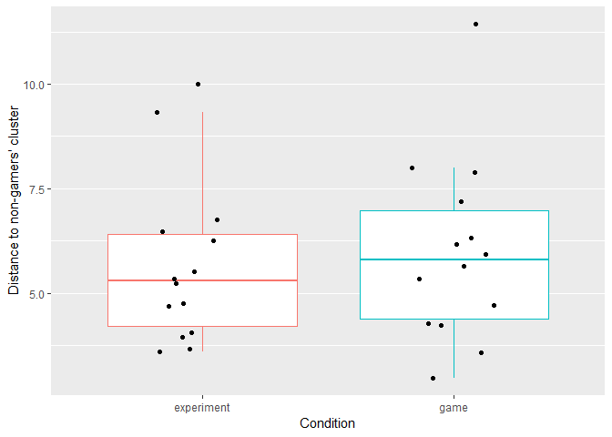
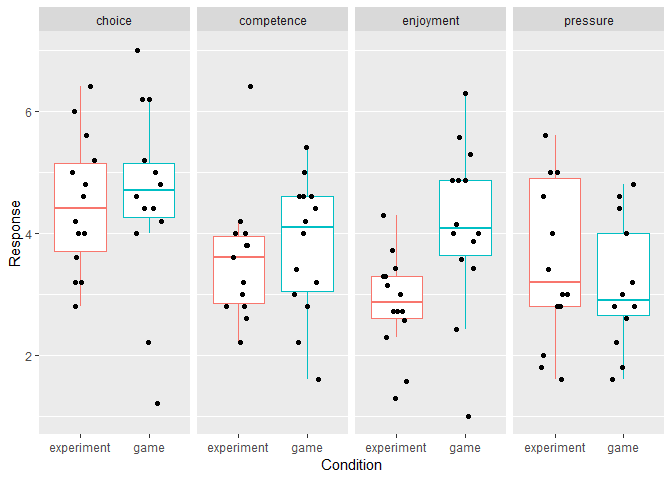

Gamification Analysis
================
Alexander (Sasha) Pastukhov
11 Juli 2018

# Loading and preprocessing the data

``` r
results <- tibble(filename= list.files(path= 'Data', pattern = 'csv$')) %>%
  rowwise() %>%
  do(suppressMessages(read_csv2(file.path('Data', .)))) %>%

  # converting selected variables to factors and using meaningful labels instead of boolean balues
  ungroup() %>%
  mutate(COA= as.factor(COA), 
        Target= as.factor(Target), 
        Condition= as.factor(Condition),
        Observer= as.factor(Observer),
        
        Match= ifelse(Match == 'True', 'match', 'mismatch'), 
        Response= ifelse(Response == 'True', 'match', 'mismatch'), 
        Correct= Match == Response)

# adding block index within the COA
results <- results %>%
  group_by(Observer, Condition, COA, Block) %>%
  summarise() %>%
  
  group_by(Observer, Condition, COA) %>%
  mutate(coaBlockIndex= 1:n()) %>%

  right_join(results, by= c('Observer', 'Condition', 'COA', 'Block')) %>%

    # retain only 12 blocks to facilitate comparison (some observers had more blocks)
  filter(Block <= 12)
```

Computing score for each trial, including the *experiment* condition
group. Later, this would show whether having a maximal score in mind
alters your behavior. For each trial the score is calculated as
\[S(t)= Combo(t) \times \frac{ 10 \times (4-RT(t))}{3}\]/, where *RT(t)*
is the response time and *Combo(t)* is a combo multiplier. The latter is
increased by 1 after every correct answer but is reset to 1 after a
mistake.

``` r
# computing time-based score, maximum is 10, but time penalty applies
# this value will be translated into the real score later, based on combo and response
results <- results %>%
  # computing the time-based score the way it was done in the game
  mutate(timebased_score= ceiling(10*((4-RT)/3))) %>%
         
  # clamping the score within 0..10 range, -1 means that the response was incorrect
  mutate(timebased_score= ifelse(timebased_score>10, 10, timebased_score),
         timebased_score= ifelse(timebased_score<0, 0, timebased_score), 
         timebased_score= ifelse(!Correct, -1, timebased_score))
         

# computing combo-based score         
compute_score_within_block <- function(timebased_score){
  combo <- 1
  score <- rep(NA, length(timebased_score))
  for(iTrial in 1:length(timebased_score)){
    if (timebased_score[iTrial]>=0){
      score[iTrial] <- timebased_score[iTrial] * combo
      combo <- combo + 1
    }
    else{
      score[iTrial] <- 0
      combo <- 1
    }
  }
  
  score
}


results <- results %>%
  group_by(Observer, Condition, COA, Block) %>%
  mutate(score= compute_score_within_block(timebased_score))

rm('compute_score_within_block')
```

# Comparing two experimental groups to see if having add-on gamification changes behaviors

## Effect of the cue-onset asynchrony (COA) and experimental condition on *performance*

``` r
performance_coa <- results %>%
  group_by(Observer, Condition, COA, coaBlockIndex) %>%
  summarise(Performance= 100 * mean(Correct), 
            logitPerformance= logit(Performance, percents = TRUE, adjust = 0.025))
  
# plot with SE as errorbars
performance_plot <-performance_coa %>%
  group_by(Condition, COA, coaBlockIndex) %>%
  summarise(Performance_avg= mean(Performance), 
            Performance_serr= sd(Performance)/sqrt(n()-1), 
            Performance_lo= Performance_avg-Performance_serr, 
            Performance_hi= Performance_avg+Performance_serr) %>%

ggplot(aes(x= coaBlockIndex, y= Performance_avg, ymin= Performance_lo, ymax= Performance_hi,
           color= Condition, linetype= Condition)) + 
  geom_errorbar(width= 0.3, linetype= 'solid')+
  geom_line() +
  geom_point(aes(shape= Condition), size= 3) +
  # geom_point(position = position_jitter(width= 0.2), color= 'black') +
  facet_grid(.~COA) +
  ylab('Performance [%]') +
  xlab('Block index') +
  theme(panel.grid.minor.x = element_blank(), legend.position = "none")

print(performance_plot)
```

<!-- -->

**Performance: Frequentist ANOVA**

``` r
# frequentist ANOVA
kable(summary(aov(logitPerformance ~ coaBlockIndex * COA * Condition, data= performance_coa))[[1]])
```

|                             |  Df |      Sum Sq |    Mean Sq |    F value |   Pr(\>F) |
| --------------------------- | --: | ----------: | ---------: | ---------: | --------: |
| coaBlockIndex               |   1 |  11.1344593 | 11.1344593 | 18.7791985 | 0.0000196 |
| COA                         |   2 |   7.0831621 |  3.5415811 |  5.9731732 | 0.0028351 |
| Condition                   |   1 |   4.8921520 |  4.8921520 |  8.2510243 | 0.0043415 |
| coaBlockIndex:COA           |   2 |   2.6884010 |  1.3442005 |  2.2671068 | 0.1052528 |
| coaBlockIndex:Condition     |   1 |   0.3457168 |  0.3457168 |  0.5830803 | 0.4456631 |
| COA:Condition               |   2 |   0.3379669 |  0.1689834 |  0.2850047 | 0.7521990 |
| coaBlockIndex:COA:Condition |   2 |   0.0225065 |  0.0112532 |  0.0189795 | 0.9812006 |
| Residuals                   | 324 | 192.1043018 |  0.5929145 |         NA |        NA |

**Performance: Permutation
ANOVA**

``` r
kable(summary(aovp(Performance ~ coaBlockIndex * COA * Condition, data= performance_coa))[[1]])
```

    ## [1] "Settings:  unique SS : numeric variables centered"

|                             |  Df |    R Sum Sq |  R Mean Sq | Iter |  Pr(Prob) |
| --------------------------- | --: | ----------: | ---------: | ---: | --------: |
| coaBlockIndex               |   1 |  2568.02094 | 2568.02094 | 5000 | 0.0000000 |
| COA                         |   2 |  1589.65257 |  794.82629 | 5000 | 0.0002000 |
| coaBlockIndex:COA           |   2 |   519.62942 |  259.81471 |  465 | 0.1956989 |
| Condition                   |   1 |  1683.42066 | 1683.42066 | 5000 | 0.0000000 |
| coaBlockIndex:Condition     |   1 |    98.23754 |   98.23754 |   51 | 0.8039216 |
| COA:Condition               |   2 |    70.55535 |   35.27767 |   51 | 1.0000000 |
| coaBlockIndex:COA:Condition |   2 |    28.10330 |   14.05165 |   51 | 1.0000000 |
| Residuals                   | 324 | 47903.86285 |  147.85143 |   NA |        NA |

**Performance: Bayesian ANOVA**

``` r
performance_coa %>%
  ungroup() %>%
  mutate(coaBlockIndex= as.factor(coaBlockIndex)) %>%
  anovaBF(logitPerformance ~ coaBlockIndex * COA * Condition, data= .) %>% 
  extractBF(.) %>%
  select(-time, -code) %>%
  kable(.)
```

    ## Warning: data coerced from tibble to data frame

|                                                                                                                             |          bf |     error |
| --------------------------------------------------------------------------------------------------------------------------- | ----------: | --------: |
| Condition                                                                                                                   |    4.574903 | 0.0000000 |
| COA                                                                                                                         |    5.234640 | 0.0000749 |
| Condition + COA                                                                                                             |   27.131298 | 0.0124652 |
| Condition + COA + Condition:COA                                                                                             |    1.997571 | 0.0286966 |
| coaBlockIndex                                                                                                               |  189.259501 | 0.0000848 |
| Condition + coaBlockIndex                                                                                                   | 1101.959926 | 0.0339303 |
| COA + coaBlockIndex                                                                                                         | 1327.628024 | 0.0093174 |
| Condition + COA + coaBlockIndex                                                                                             | 9067.301571 | 0.0501334 |
| Condition + COA + Condition:COA + coaBlockIndex                                                                             |  676.641022 | 0.0337140 |
| Condition + coaBlockIndex + Condition:coaBlockIndex                                                                         |   70.531195 | 0.0185891 |
| Condition + COA + coaBlockIndex + Condition:coaBlockIndex                                                                   |  654.363103 | 0.0716340 |
| Condition + COA + Condition:COA + coaBlockIndex + Condition:coaBlockIndex                                                   |   43.944193 | 0.0241684 |
| COA + coaBlockIndex + COA:coaBlockIndex                                                                                     |  101.779512 | 0.0118232 |
| Condition + COA + coaBlockIndex + COA:coaBlockIndex                                                                         |  681.835256 | 0.0179765 |
| Condition + COA + Condition:COA + coaBlockIndex + COA:coaBlockIndex                                                         |   51.341597 | 0.0174603 |
| Condition + COA + coaBlockIndex + Condition:coaBlockIndex + COA:coaBlockIndex                                               |   47.861849 | 0.0255261 |
| Condition + COA + Condition:COA + coaBlockIndex + Condition:coaBlockIndex + COA:coaBlockIndex                               |    3.599807 | 0.0221650 |
| Condition + COA + Condition:COA + coaBlockIndex + Condition:coaBlockIndex + COA:coaBlockIndex + Condition:COA:coaBlockIndex |    0.149378 | 0.0209928 |

``` r
rm(performance_coa, performance_plot)
```

## Effect of the cue-onset asynchrony (COA) and experimental condition on *response times*

``` r
RT_coa <- results %>%
  group_by(Observer, Condition, COA, coaBlockIndex) %>%
  summarise(RT= median(RT))

# plot with SE as errorbars
RT_plot <- RT_coa %>%
  group_by(Condition, COA, coaBlockIndex) %>%
  summarise(RT_avg= mean(RT), 
            RT_serr= sd(RT)/sqrt(n()-1), 
            RT_lo= RT_avg-RT_serr, 
            RT_hi= RT_avg+RT_serr) %>%

 ggplot(aes(x= coaBlockIndex, y= RT_avg, ymin= RT_lo, ymax= RT_hi,
           color= Condition, linetype= Condition)) + 
  geom_errorbar(width= 0.3)+
  geom_line() +
  geom_point(aes(shape= Condition), size= 3) +
  # geom_point(position = position_jitter(width= 0.2), color= 'black') +
  facet_grid(.~COA) +
  ylab('Median RT [s]') +
  xlab('Block index') +
  theme(panel.grid.minor.x = element_blank(), legend.position = "none")

print(RT_plot)
```

<!-- -->

``` r
# ggsave('Between-RT.pdf', RT_plot, path= 'Plots', width = 20, height = 20/1.5, units = 'cm', useDingbats= FALSE)
```

**RT: Frequentist ANOVA**

``` r
# frequentist ANOVA
kable(summary(aov(RT ~ coaBlockIndex * COA * Condition, data= RT_coa))[[1]])
```

|                             |  Df |      Sum Sq |   Mean Sq |    F value |   Pr(\>F) |
| --------------------------- | --: | ----------: | --------: | ---------: | --------: |
| coaBlockIndex               |   1 |   8.5593621 | 8.5593621 | 16.9380538 | 0.0000490 |
| COA                         |   2 |   0.0060435 | 0.0030217 |  0.0059797 | 0.9940382 |
| Condition                   |   1 |   3.4040437 | 3.4040437 |  6.7362351 | 0.0098773 |
| coaBlockIndex:COA           |   2 |   0.0254060 | 0.0127030 |  0.0251379 | 0.9751773 |
| coaBlockIndex:Condition     |   1 |   0.0010744 | 0.0010744 |  0.0021261 | 0.9632511 |
| COA:Condition               |   2 |   0.0053423 | 0.0026712 |  0.0052859 | 0.9947281 |
| coaBlockIndex:COA:Condition |   2 |   0.5221628 | 0.2610814 |  0.5166519 | 0.5970050 |
| Residuals                   | 324 | 163.7279790 | 0.5053333 |         NA |        NA |

**RT: Permutation
ANOVA**

``` r
kable(summary(aovp(RT ~ coaBlockIndex * COA * Condition, data= RT_coa))[[1]])
```

    ## [1] "Settings:  unique SS : numeric variables centered"

|                             |  Df |    R Sum Sq | R Mean Sq | Iter |  Pr(Prob) |
| --------------------------- | --: | ----------: | --------: | ---: | --------: |
| coaBlockIndex               |   1 |   8.5593621 | 8.5593621 | 5000 | 0.0000000 |
| COA                         |   2 |   0.0060435 | 0.0030217 |   51 | 0.9607843 |
| coaBlockIndex:COA           |   2 |   0.0254060 | 0.0127030 |   56 | 1.0000000 |
| Condition                   |   1 |   3.4040437 | 3.4040437 | 5000 | 0.0052000 |
| coaBlockIndex:Condition     |   1 |   0.0010744 | 0.0010744 |   51 | 1.0000000 |
| COA:Condition               |   2 |   0.0053423 | 0.0026712 |   51 | 1.0000000 |
| coaBlockIndex:COA:Condition |   2 |   0.5221628 | 0.2610814 |  547 | 0.7184644 |
| Residuals                   | 324 | 163.7279790 | 0.5053333 |   NA |        NA |

**RT: Bayesian ANOVA**

``` r
RT_coa %>%
  ungroup() %>%
  mutate(coaBlockIndex= as.factor(coaBlockIndex)) %>%
  anovaBF(RT ~ coaBlockIndex * COA * Condition, data= .) %>% 
  extractBF(.) %>%
  select(-time, -code) %>%
  kable(.)
```

    ## Warning: data coerced from tibble to data frame

|                                                                                                                             |         bf |     error |
| --------------------------------------------------------------------------------------------------------------------------- | ---------: | --------: |
| Condition                                                                                                                   |  2.7634003 | 0.0000000 |
| COA                                                                                                                         |  0.0326108 | 0.0001208 |
| Condition + COA                                                                                                             |  0.0872533 | 0.0154950 |
| Condition + COA + Condition:COA                                                                                             |  0.0054225 | 0.0301272 |
| coaBlockIndex                                                                                                               | 27.0903428 | 0.0000054 |
| Condition + coaBlockIndex                                                                                                   | 84.9964982 | 0.0174962 |
| COA + coaBlockIndex                                                                                                         |  1.0292044 | 0.1420072 |
| Condition + COA + coaBlockIndex                                                                                             |  2.7060148 | 0.0132721 |
| Condition + COA + Condition:COA + coaBlockIndex                                                                             |  0.1644377 | 0.0250486 |
| Condition + coaBlockIndex + Condition:coaBlockIndex                                                                         |  4.7942244 | 0.0616054 |
| Condition + COA + coaBlockIndex + Condition:coaBlockIndex                                                                   |  0.1421608 | 0.0250814 |
| Condition + COA + Condition:COA + coaBlockIndex + Condition:coaBlockIndex                                                   |  0.0081792 | 0.0212815 |
| COA + coaBlockIndex + COA:coaBlockIndex                                                                                     |  0.0102685 | 0.0097456 |
| Condition + COA + coaBlockIndex + COA:coaBlockIndex                                                                         |  0.0321199 | 0.0150075 |
| Condition + COA + Condition:COA + coaBlockIndex + COA:coaBlockIndex                                                         |  0.0020222 | 0.0276981 |
| Condition + COA + coaBlockIndex + Condition:coaBlockIndex + COA:coaBlockIndex                                               |  0.0017268 | 0.0282693 |
| Condition + COA + Condition:COA + coaBlockIndex + Condition:coaBlockIndex + COA:coaBlockIndex                               |  0.0001034 | 0.0391212 |
| Condition + COA + Condition:COA + coaBlockIndex + Condition:coaBlockIndex + COA:coaBlockIndex + Condition:COA:coaBlockIndex |  0.0000046 | 0.0489720 |

``` r
rm(RT_coa, RT_plot)
```

## Effect of the cue-onset asynchrony (COA) and experimental condition on *total score*

``` r
score_coa <- results %>%
  group_by(Observer, Condition, COA, coaBlockIndex) %>%
  summarise(`Block Score`= sum(score))

# plot with SE as errorbars
score_plot <- score_coa %>%
  group_by(Condition, COA, coaBlockIndex) %>%
  summarise(Score_avg= mean(`Block Score`), 
            Score_serr= sd(`Block Score`)/sqrt(n()-1), 
            Score_lo= Score_avg-Score_serr, 
            Score_hi= Score_avg+Score_serr) %>%

ggplot(aes(x= coaBlockIndex, y= Score_avg, ymin= Score_lo, ymax= Score_hi,
           color= Condition, linetype= Condition)) + 
  geom_errorbar(width= 0.3)+
  geom_line() +
  geom_point(aes(shape= Condition), size= 3) +
  # geom_point(position = position_jitter(width= 0.2), color= 'black') +
  facet_grid(.~COA) +
  ylab('Score [points]') +
  xlab('Block index') + 
  theme(panel.grid.minor.x = element_blank(), legend.position = "none")
print(score_plot)
```

<!-- -->

``` r
# ggsave('Between-Score.pdf', score_plot, path= 'Plots', width = 20, height = 20/1.5, units = 'cm', useDingbats= FALSE)
```

**Score: Frequentist ANOVA**

``` r
# frequentist ANOVA
# frequentist ANOVA
kable(summary(aov(`Block Score` ~ coaBlockIndex * COA * Condition, data= score_coa))[[1]])
```

|                             |  Df |       Sum Sq |    Mean Sq |    F value |   Pr(\>F) |
| --------------------------- | --: | -----------: | ---------: | ---------: | --------: |
| coaBlockIndex               |   1 |   56330349.0 | 56330349.0 | 15.9337826 | 0.0000812 |
| COA                         |   2 |   60049892.9 | 30024946.4 |  8.4929523 | 0.0002541 |
| Condition                   |   1 |    5722164.0 |  5722164.0 |  1.6185896 | 0.2042009 |
| coaBlockIndex:COA           |   2 |   12342389.1 |  6171194.5 |  1.7456038 | 0.1761770 |
| coaBlockIndex:Condition     |   1 |      13645.8 |    13645.8 |  0.0038599 | 0.9504992 |
| COA:Condition               |   2 |    4163687.5 |  2081843.7 |  0.5888770 | 0.5555430 |
| coaBlockIndex:COA:Condition |   2 |     633022.2 |   316511.1 |  0.0895293 | 0.9143841 |
| Residuals                   | 324 | 1145430033.5 |  3535277.9 |         NA |        NA |

**Score: Permutation
ANOVA**

``` r
kable(summary(aovp(`Block Score` ~ coaBlockIndex * COA * Condition, data= score_coa))[[1]])
```

    ## [1] "Settings:  unique SS : numeric variables centered"

|                             |  Df |     R Sum Sq |  R Mean Sq | Iter |  Pr(Prob) |
| --------------------------- | --: | -----------: | ---------: | ---: | --------: |
| coaBlockIndex               |   1 |   56330349.0 | 56330349.0 | 5000 | 0.0000000 |
| COA                         |   2 |   60049892.9 | 30024946.4 | 5000 | 0.0000000 |
| coaBlockIndex:COA           |   2 |   12342389.1 |  6171194.5 | 2959 | 0.0672525 |
| Condition                   |   1 |    5722164.0 |  5722164.0 |  504 | 0.1666667 |
| coaBlockIndex:Condition     |   1 |      13645.8 |    13645.8 |   51 | 0.8627451 |
| COA:Condition               |   2 |    4163687.5 |  2081843.7 |  591 | 0.5922166 |
| coaBlockIndex:COA:Condition |   2 |     633022.2 |   316511.1 |   61 | 0.9672131 |
| Residuals                   | 324 | 1145430033.5 |  3535277.9 |   NA |        NA |

**Score: Bayesian ANOVA**

``` r
score_coa %>%
  ungroup() %>%
  mutate(coaBlockIndex= as.factor(coaBlockIndex)) %>%
  anovaBF(`Block Score` ~ coaBlockIndex * COA * Condition, data= .) %>% 
  extractBF(.) %>%
  select(-time, -code) %>%
  kable(.)
```

    ## Warning: data coerced from tibble to data frame

|                                                                                                                             |           bf |     error |
| --------------------------------------------------------------------------------------------------------------------------- | -----------: | --------: |
| Condition                                                                                                                   |    0.2463402 | 0.0000003 |
| COA                                                                                                                         |   53.8523013 | 0.0000876 |
| Condition + COA                                                                                                             |   13.8392205 | 0.0266332 |
| Condition + COA + Condition:COA                                                                                             |    1.3238299 | 0.0273656 |
| coaBlockIndex                                                                                                               |   55.7763590 | 0.0000041 |
| Condition + coaBlockIndex                                                                                                   |   13.7998199 | 0.0111552 |
| COA + coaBlockIndex                                                                                                         | 4465.8437694 | 0.0117079 |
| Condition + COA + coaBlockIndex                                                                                             | 1191.8323263 | 0.0204847 |
| Condition + COA + Condition:COA + coaBlockIndex                                                                             |  117.6163853 | 0.0261022 |
| Condition + coaBlockIndex + Condition:coaBlockIndex                                                                         |    0.7218411 | 0.0309177 |
| Condition + COA + coaBlockIndex + Condition:coaBlockIndex                                                                   |   58.2110359 | 0.0221130 |
| Condition + COA + Condition:COA + coaBlockIndex + Condition:coaBlockIndex                                                   |    5.8272815 | 0.0337759 |
| COA + coaBlockIndex + COA:coaBlockIndex                                                                                     |  288.9664682 | 0.0213403 |
| Condition + COA + coaBlockIndex + COA:coaBlockIndex                                                                         |   75.1487702 | 0.0267673 |
| Condition + COA + Condition:COA + coaBlockIndex + COA:coaBlockIndex                                                         |    7.3502517 | 0.0190246 |
| Condition + COA + coaBlockIndex + Condition:coaBlockIndex + COA:coaBlockIndex                                               |    3.6927104 | 0.0229523 |
| Condition + COA + Condition:COA + coaBlockIndex + Condition:coaBlockIndex + COA:coaBlockIndex                               |    0.3547936 | 0.0181434 |
| Condition + COA + Condition:COA + coaBlockIndex + Condition:coaBlockIndex + COA:coaBlockIndex + Condition:COA:coaBlockIndex |    0.0215046 | 0.0556946 |

``` r
rm(score_coa, score_plot)
```

# Post-study questionnaires

``` r
questionnaire <- suppressMessages(read_csv2(file.path('Questionnaire', 'Questionnaire_ErsteTestung_ohneIFN_pressure invertiert_ohne pressure.csv'))) %>%
  ungroup() %>%
  mutate(Condition= as.factor(Condition))
```

## Gamer/Non-gamer

This questionnaire is important to check the balance between the two
experimental groups

``` r
gamer <- questionnaire %>%
  mutate(d_nonGamer= sqrt((GP01_01-2.58)^2+(GP02_01-1.61)^2+
                     (GP02_02-1.88)^2+(GP02_03-4.3)^2+
                     (GP02_04-1.49)^2+(GP02_05-2.69)^2+
                     (GP02_06-2.20)^2+(GP02_07-2.59)^2+
                     (GP02_08-4.68)^2+(GP02_09-2.20)^2)) %>%
  select(Observer, Condition, d_nonGamer)

oneway_test(d_nonGamer ~ Condition, gamer)
```

    ## 
    ##  Asymptotic Two-Sample Fisher-Pitman Permutation Test
    ## 
    ## data:  d_nonGamer by Condition (experiment, game)
    ## Z = -0.37617, p-value = 0.7068
    ## alternative hypothesis: true mu is not equal to 0

``` r
gamer_plot <- gamer %>% ggplot(aes(x= Condition, y= d_nonGamer, color= Condition)) +
  geom_boxplot(outlier.shape = NA) + 
  geom_point(position = position_jitter(height = 0, width = 0.2), color= 'black') + 
  ylab("Distance to non-gamers' cluster") + 
  theme(panel.grid.major.x = element_blank(), legend.position = "none")
print(gamer_plot)
```

<!-- -->

``` r
# ggsave('Gaming habits.pdf', path= 'Plots', width = 12, height = 8, units = 'cm', useDingbats= FALSE)

rm(gamer, gamer_plot)
```

## Intrinsic Motivation

``` r
# computing subscales for the Intrinsic Motivation
IM <- questionnaire %>%
  mutate(enjoyment =  ((IM01_01 + IM01_05 + IM01_08 + IM01_10 + IM01_14 + IM01_17 + IM01_20)/7),
         competence = ((IM01_04 + IM01_07 + IM01_12 + IM01_16 + IM01_22)/5),
         choice = ((IM01_03 + IM01_11 + IM01_15 + IM01_19 + IM01_21)/5),
         antipressure = ((IM01_02_i + IM01_06_i + IM01_09_i + IM01_13_i + IM01_18_i)/5)) %>%
  
  select(Observer, Condition, enjoyment, competence, choice, antipressure) %>%
  gather(key= "Subscale", value = "Response", -Observer, -Condition)

oneway_permutation_test <- function(subscaleDF){
  test_results <- oneway_test(Response ~ Condition, data= subscaleDF)
  
  
  tibble(Subscale= subscaleDF$Subscale[1], Z= statistic(test_results), pvalue= pvalue(test_results))
}

# Fisher-Pitman permutation test on each subscale, multiple comparions adjustment via Holm's method 
IM %>% 
  group_by(Subscale) %>%
  do(oneway_permutation_test(.)) %>%
  ungroup() %>%
  mutate(`p(adjusted)`= p.adjust(pvalue, method = 'holm')) %>%
  kable(.)
```

| Subscale     |           Z |    pvalue | p(adjusted) |
| :----------- | ----------: | --------: | ----------: |
| antipressure | \-0.8032385 | 0.4218369 |   1.0000000 |
| choice       | \-0.2628970 | 0.7926300 |   1.0000000 |
| competence   | \-0.5404975 | 0.5888540 |   1.0000000 |
| enjoyment    | \-2.7117838 | 0.0066922 |   0.0267689 |

``` r
IM_plot <- IM %>% ggplot(aes(x= Condition, y= Response, color= Condition)) +
  geom_boxplot(outlier.shape = NA) + 
  geom_point(position = position_jitter(height = 0, width = 0.2), color= 'black') + 
  facet_grid(. ~ Subscale) + 
  theme(panel.grid.major.x = element_blank(), legend.position = "none")

print(IM_plot)
```

<!-- -->

``` r
# ggsave('IM.pdf', IM_plot, path= 'Plots', width = 24, height = 16, units = 'cm', useDingbats= FALSE)

rm('oneway_permutation_test', IM, IM_plot)
```
